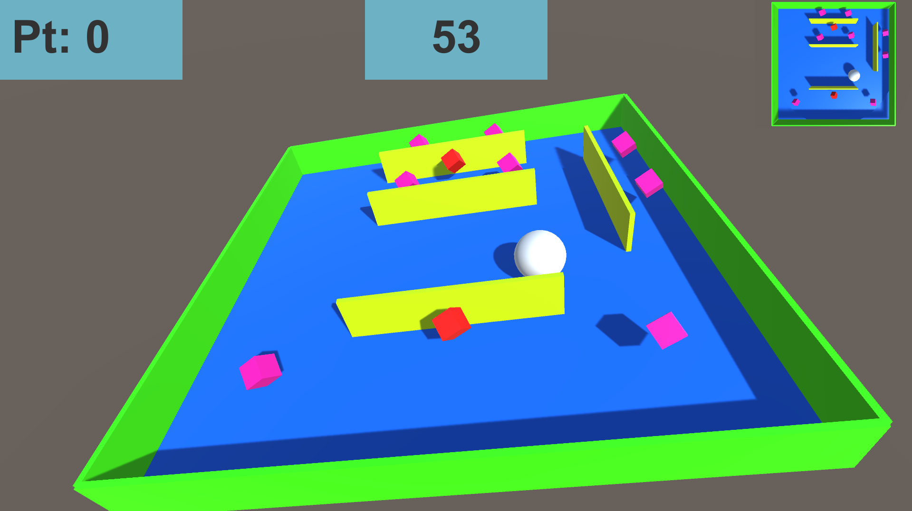

# ゲームジャム概要
- 大学研究室開催(非公式)
- 時間：15:40 - 18:00
- テーマ：球転がし
# ゲーム内容
## プレイ画面

## 概要
- 板を傾けて球を転がしていく。
- 道中に浮いているオブジェクトに球を当てることでポイントをためていく。(制限時間は60秒)
- そのポイント+残り時間*係数が最終的なスコアとなる
- 右上に参考のために板を真上から見た様子が映っている
## 操作
- マウス：板の回転
- 「Enter」：ゲーム開始、リザルトから初期画面への遷移
- 「R」：球をリスポーン(まれに球が消えたり動かなくなったりするので救済措置)
